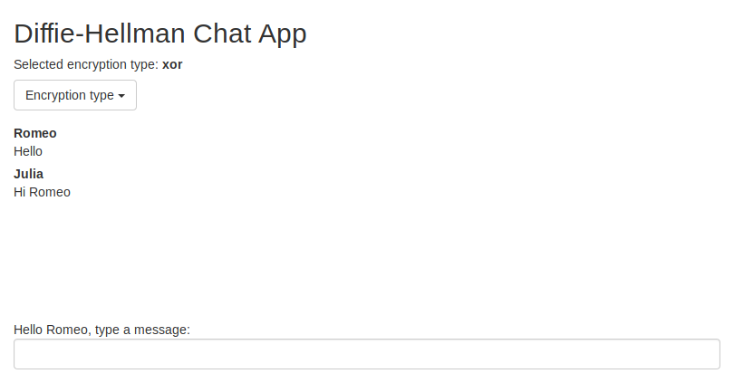

# Diffie-Hellman Chat App
A simple web app implementing the Diffie-Hellman key exchange.

# Basic usage
In the repository you'll find a client and server app.
Each of them has a separate README.md with a configuration section.
You need to start both of them.

Alternatively you can use docker-compose to run both applications:
```
docker-compose up
```
Then navigate to `localhost:3000`.




